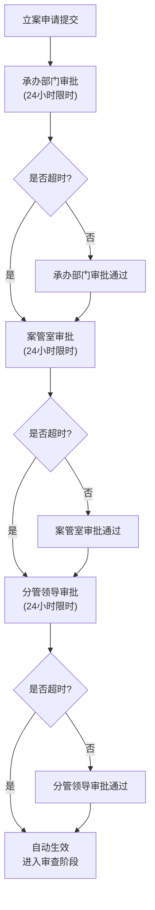

## 1. 产品概述

智慧纪检监察综合管理平台是一款面向纪检监察机关的全流程数字化管理系统，整合信访举报、线索研判、立案审批、案件审查、审理结案全生命周期管理，实现纪检监察工作的规范化、透明化和智能化。

- 主要用途：实现纪检监察业务全流程数字化管理，提升办案效率，强化监督执纪问责能力
- 目标用户：纪检监察机关承办人、部门负责人、案管室工作人员、分管领导
- 核心价值：通过智能分级、自动预警、流程跟踪等功能，实现案件管理的科学化和规范化

## 2. 核心功能

### 2.1 用户角色

| 角色 | 注册方式 | 核心权限 |
|------|----------|----------|
| 承办人 | 系统分配 | 仅查看和办理本人负责的案件，录入信访举报、填写审查笔录 |
| 部门负责人 | 系统分配 | 查看本部门所有案件，审批立案申请，分配案件任务 |
| 案管室 | 系统分配 | 查看全局所有案件，监督流程运转，管理数据统计，导出分析报告 |
| 分管领导 | 系统分配 | 审批重大案件，查看全局数据，进行决策分析 |

### 2.2 功能模块

1. **首页大屏**：案件存量统计、分流效率、结案率、超期预警、实时数据刷新、多维度筛选、报告导出
2. **信访举报管理**：举报录入、自动分类、智能推送承办部门、举报台账
3. **线索研判管理**：线索登记、自动分级、高风险预警、线索分流、48小时未启动自动升级
4. **立案审批管理**：立案申请、三级审批流转（承办部门→案管室→分管领导）、每级24小时限时、超时自动越级
5. **案件审查管理**：案件分配、谈话提醒自动生成、同步录音录像上传、笔录关联、超期未谈话预警
6. **审理结案管理**：在线阅卷、电子签名、处分决定书自动生成、执行推送、案件归档
7. **系统管理**：用户管理、权限配置、日志审计、系统设置

### 2.3 页面详情

| 页面名称 | 模块名称 | 功能描述 |
|-----------|-------------|---------------------|
| 登录页 | 身份认证 | 用户登录、角色识别、权限验证 |
| 首页大屏 | 数据概览 | 案件存量、分流效率、结案率、超期预警实时展示，多维度筛选，一键导出报告 |
| 信访举报列表页 | 信访管理 | 举报列表、分类筛选、状态跟踪、新增举报 |
| 信访举报详情页 | 信访详情 | 举报信息查看、分类标签、推送记录、关联线索 |
| 线索列表页 | 线索管理 | 线索列表、分级标识、风险预警、筛选搜索 |
| 线索详情页 | 线索详情 | 线索信息、分级结果、流转记录、启动调查操作 |
| 立案审批页 | 立案管理 | 审批列表、待办提醒、审批操作、流程跟踪 |
| 案件审查页 | 审查管理 | 案件列表、谈话安排、笔录录入、音视频上传 |
| 审理结案页 | 审理管理 | 待审案件、在线阅卷、电子签名、处分决定生成 |
| 统计分析页 | 数据统计 | 多维统计图表、趋势分析、对比分析 |
| 系统设置页 | 系统管理 | 用户管理、权限配置、操作日志 |

## 3. 核心流程

### 3.1 案件办理主流程

信访举报接收 → 自动分类推送 → 线索登记分级 → 高风险预警 → 立案申请 → 三级审批 → 案件分配 → 谈话提醒 → 审查取证 → 在线审理 → 电子签名 → 结案归档 → 处分决定执行

### 3.2 审批流转流程



### 3.3 线索分级流程

```mermaid
flowchart TD
    A["线索登记"] --> B["违纪类型识别"]
    A --> C["涉案金额识别"]
    B --> D["智能分级引擎"]
    C --> D
    D --> E{"风险等级"}
    E -->|低风险| F["常规处理流程"]
    E -->|中风险| G["优先处理流程"]
    E -->|高风险| H["48小时倒计时启动"]
    H --> I{"是否启动调查?"}
    I -->|否(超时)| J["自动升级\n推送领导"]
    I -->|是| K["进入正常审查"]
```

## 4. 用户界面设计

### 4.1 设计风格

- **主色调**：正红色（#C8102E）代表纪检监察的严肃性和权威性
- **辅助色**：深海军蓝（#003366）象征稳重和专业
- **中性色**：深灰（#1A1A2E）、中灰（#4A4A6A）、浅灰（#E8E8F0）、白色（#FFFFFF）
- **功能色**：绿色（#10B981）表示正常、橙色（#F59E0B）表示预警、红色（#EF4444）表示超期、蓝色（#3B82F6）表示进行中

- **按钮风格**：直角微圆角（2px），庄重大气，主按钮采用正红色填充，次要按钮采用边框样式
- **字体**：采用思源宋体（Source Han Serif）作为标题字体，体现正式庄重；思源黑体（Source Han Sans）作为正文字体，保证清晰度
- **布局风格**：顶部导航 + 左侧菜单 + 右侧内容区的经典政务系统布局，卡片式模块展示
- **图标风格**：线性图标为主，保持简洁专业，符合政务系统的严谨风格

### 4.2 页面设计概述

| 页面名称 | 模块名称 | UI Elements |
|-----------|-------------|-------------|
| 首页大屏 | 数据概览 | 深红色主题顶部栏，实时数据卡片网格，动态数字滚动，超期预警闪烁动画，图表数据可视化，5秒刷新指示器，筛选工具栏，导出按钮 |
| 信访举报列表 | 列表展示 | 左侧树形分类导航，右侧数据表格，标签状态指示，批量操作栏，搜索筛选区，分页组件 |
| 案件详情页 | 详情展示 | 顶部案件基本信息卡，左侧流程时间轴，右侧详情标签页，审批操作区，附件列表，操作日志 |
| 审批页 | 审批操作 | 待办卡片列表，流程进度条，审批意见输入区，电子签名区，审批操作按钮组 |

### 4.3 响应式

- **桌面优先**：针对政务办公场景，以1920×1080分辨率为主要设计基准
- **大屏适配**：首页大屏支持2K/4K高清显示，自适应缩放布局
- **平板适配**：简化侧边菜单为可折叠模式，优化表格列宽自适应
- **移动适配**：核心功能（待办审批、预警查看）支持移动端访问，采用单列布局

### 4.4 数据可视化

- **环境与氛围**：深色背景配合红色警示元素，营造监控中心氛围
- **图表类型**：柱状图展示各部门案件量，折线图展示趋势变化，饼图展示违纪类型占比，雷达图展示部门绩效
- **动态效果**：数据加载动画，数字滚动效果，超期预警脉冲闪烁
- **交互**：支持图表点击下钻查看明细，hover显示详细数据
