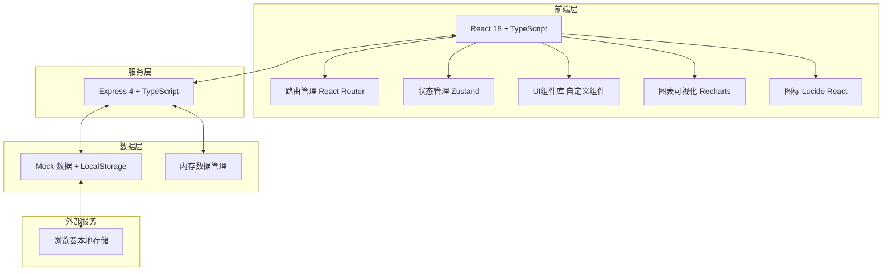
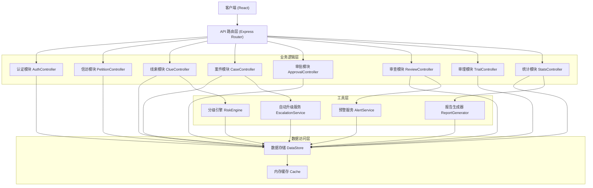
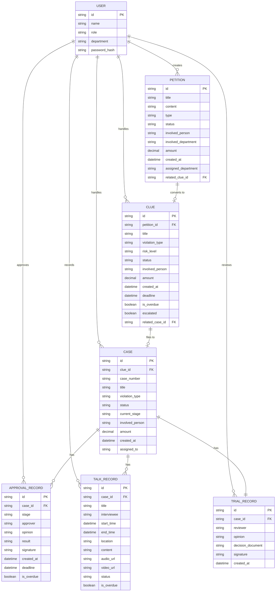

## 1. 架构设计



## 2. 技术描述

- **前端**：React@18 + TypeScript + Vite@5 + TailwindCSS@3 + Zustand@4 + React Router@6 + Recharts@2 + Lucide React@0.400
- **初始化工具**：vite-init
- **后端**：Express@4 + TypeScript
- **数据存储**：LocalStorage 持久化 + 内存数据管理，使用 Mock 数据演示功能
- **构建工具**：Vite@5

## 3. 路由定义

| 路由 | 页面名称 | 权限要求 |
|-------|---------|----------|
| /login | 登录页 | 公开 |
| /dashboard | 首页大屏 | 登录用户 |
| /petition | 信访举报列表 | 登录用户 |
| /petition/:id | 信访举报详情 | 登录用户 |
| /petition/new | 新增信访举报 | 承办人及以上 |
| /clues | 线索列表 | 登录用户 |
| /clues/:id | 线索详情 | 登录用户 |
| /cases | 案件列表 | 登录用户 |
| /cases/:id | 案件详情 | 登录用户 |
| /approval | 立案审批 | 部门负责人及以上 |
| /review | 案件审查 | 承办人及以上 |
| /trial | 审理结案 | 案管室及以上 |
| /statistics | 统计分析 | 案管室及以上 |
| /settings | 系统设置 | 案管室及以上 |

## 4. API 定义

### 4.1 类型定义

```typescript
// 用户角色类型
type UserRole = 'handler' | 'dept_head' | 'case_office' | 'leader';

// 用户信息
interface User {
  id: string;
  name: string;
  role: UserRole;
  department: string;
  avatar?: string;
}

// 信访举报
interface Petition {
  id: string;
  title: string;
  content: string;
  informant?: string;
  informantContact?: string;
  type: PetitionType;
  status: PetitionStatus;
  involvedPerson: string;
  involvedDepartment: string;
  amount?: number;
  createdAt: string;
  assignedTo?: string;
  assignedDepartment: string;
  relatedClueId?: string;
}

type PetitionType = 'corruption' | 'dereliction' | 'malfeasance' | 'style' | 'other';
type PetitionStatus = 'pending' | 'processing' | 'assigned' | 'converted' | 'closed';

// 线索
interface Clue {
  id: string;
  petitionId?: string;
  title: string;
  description: string;
  violationType: ViolationType;
  amount?: number;
  riskLevel: RiskLevel;
  status: ClueStatus;
  involvedPerson: string;
  involvedDepartment: string;
  createdAt: string;
  deadline?: string;
  isOverdue: boolean;
  escalated: boolean;
  assignedTo?: string;
  relatedCaseId?: string;
}

type ViolationType = 'political' | 'economic' | 'work' | 'life' | 'other';
type RiskLevel = 'low' | 'medium' | 'high';
type ClueStatus = 'pending' | 'reviewing' | 'investigating' | 'filed' | 'closed';

// 案件
interface Case {
  id: string;
  clueId?: string;
  caseNumber: string;
  title: string;
  description: string;
  violationType: ViolationType;
  status: CaseStatus;
  involvedPerson: string;
  involvedDepartment: string;
  amount?: number;
  createdAt: string;
  assignedTo: string;
  currentStage: CaseStage;
  approvalHistory: ApprovalRecord[];
  talkRecords: TalkRecord[];
  trialRecord?: TrialRecord;
}

type CaseStatus = 'pending_approval' | 'approved' | 'investigating' | 'trial' | 'closed';
type CaseStage = 'approval' | 'investigation' | 'trial' | 'execution' | 'archived';

// 审批记录
interface ApprovalRecord {
  id: string;
  caseId: string;
  stage: ApprovalStage;
  approver: string;
  approverRole: string;
  opinion: string;
  result: 'approved' | 'rejected' | 'escalated';
  signature?: string;
  createdAt: string;
  deadline: string;
  isOverdue: boolean;
}

type ApprovalStage = 'department' | 'case_office' | 'leader';

// 谈话记录
interface TalkRecord {
  id: string;
  caseId: string;
  title: string;
  interviewee: string;
  startTime: string;
  endTime?: string;
  location: string;
  recorder: string;
  content: string;
  audioUrl?: string;
  videoUrl?: string;
  status: TalkStatus;
  isOverdue: boolean;
  reminderSent: boolean;
}

type TalkStatus = 'scheduled' | 'in_progress' | 'completed';

// 审理记录
interface TrialRecord {
  id: string;
  caseId: string;
  reviewer: string;
  opinion: string;
  decisionDocument: string;
  signature?: string;
  createdAt: string;
}

// 统计数据
interface DashboardStats {
  totalCases: number;
  pendingCases: number;
  completedCases: number;
  overdueCases: number;
  closingRate: number;
  distributionEfficiency: number;
  casesByType: Record<ViolationType, number>;
  casesByDepartment: Record<string, number>;
  trendData: { date: string; count: number }[];
}
```

### 4.2 API 接口

```typescript
// 认证接口
POST /api/auth/login - 用户登录
POST /api/auth/logout - 用户登出
GET /api/auth/me - 获取当前用户

// 信访举报接口
GET /api/petitions - 获取信访举报列表
GET /api/petitions/:id - 获取信访举报详情
POST /api/petitions - 创建信访举报
PUT /api/petitions/:id - 更新信访举报
PUT /api/petitions/:id/assign - 分配信访举报

// 线索接口
GET /api/clues - 获取线索列表
GET /api/clues/:id - 获取线索详情
POST /api/clues - 创建线索
PUT /api/clues/:id - 更新线索
PUT /api/clues/:id/start - 启动调查
PUT /api/clues/:id/escalate - 升级线索

// 案件接口
GET /api/cases - 获取案件列表
GET /api/cases/:id - 获取案件详情
POST /api/cases - 创建案件（立案申请）
PUT /api/cases/:id - 更新案件

// 审批接口
GET /api/approvals - 获取审批列表
GET /api/approvals/:id - 获取审批详情
PUT /api/approvals/:id/approve - 审批通过
PUT /api/approvals/:id/reject - 审批驳回

// 审查接口
GET /api/talks - 获取谈话列表
POST /api/talks - 创建谈话
PUT /api/talks/:id - 更新谈话
POST /api/talks/:id/upload - 上传音视频

// 审理接口
GET /api/trials - 获取审理列表
POST /api/trials/:id/review - 提交审理意见
POST /api/trials/:id/sign - 电子签名
GET /api/trials/:id/decision - 生成处分决定书

// 统计接口
GET /api/stats/dashboard - 获取首页大屏数据
GET /api/stats/trend - 获取趋势数据
GET /api/stats/export - 导出月度报告
```

## 5. 服务器架构图



## 6. 数据模型

### 6.1 ER 图



### 6.2 DDL 语句

```sql
-- 用户表
CREATE TABLE users (
    id VARCHAR(36) PRIMARY KEY,
    name VARCHAR(50) NOT NULL,
    role VARCHAR(20) NOT NULL,
    department VARCHAR(100) NOT NULL,
    password_hash VARCHAR(255) NOT NULL,
    created_at DATETIME DEFAULT CURRENT_TIMESTAMP
);

-- 信访举报表
CREATE TABLE petitions (
    id VARCHAR(36) PRIMARY KEY,
    title VARCHAR(200) NOT NULL,
    content TEXT NOT NULL,
    informant VARCHAR(50),
    informant_contact VARCHAR(50),
    type VARCHAR(20) NOT NULL,
    status VARCHAR(20) NOT NULL DEFAULT 'pending',
    involved_person VARCHAR(50) NOT NULL,
    involved_department VARCHAR(100) NOT NULL,
    amount DECIMAL(15,2),
    created_at DATETIME DEFAULT CURRENT_TIMESTAMP,
    assigned_to VARCHAR(36),
    assigned_department VARCHAR(100),
    related_clue_id VARCHAR(36),
    FOREIGN KEY (assigned_to) REFERENCES users(id)
);

-- 线索表
CREATE TABLE clues (
    id VARCHAR(36) PRIMARY KEY,
    petition_id VARCHAR(36),
    title VARCHAR(200) NOT NULL,
    description TEXT NOT NULL,
    violation_type VARCHAR(20) NOT NULL,
    amount DECIMAL(15,2),
    risk_level VARCHAR(10) NOT NULL,
    status VARCHAR(20) NOT NULL DEFAULT 'pending',
    involved_person VARCHAR(50) NOT NULL,
    involved_department VARCHAR(100) NOT NULL,
    created_at DATETIME DEFAULT CURRENT_TIMESTAMP,
    deadline DATETIME,
    is_overdue BOOLEAN DEFAULT FALSE,
    escalated BOOLEAN DEFAULT FALSE,
    assigned_to VARCHAR(36),
    related_case_id VARCHAR(36),
    FOREIGN KEY (petition_id) REFERENCES petitions(id),
    FOREIGN KEY (assigned_to) REFERENCES users(id)
);

-- 案件表
CREATE TABLE cases (
    id VARCHAR(36) PRIMARY KEY,
    clue_id VARCHAR(36),
    case_number VARCHAR(50) UNIQUE NOT NULL,
    title VARCHAR(200) NOT NULL,
    description TEXT NOT NULL,
    violation_type VARCHAR(20) NOT NULL,
    status VARCHAR(20) NOT NULL DEFAULT 'pending_approval',
    current_stage VARCHAR(20) NOT NULL DEFAULT 'approval',
    involved_person VARCHAR(50) NOT NULL,
    involved_department VARCHAR(100) NOT NULL,
    amount DECIMAL(15,2),
    created_at DATETIME DEFAULT CURRENT_TIMESTAMP,
    assigned_to VARCHAR(36) NOT NULL,
    FOREIGN KEY (clue_id) REFERENCES clues(id),
    FOREIGN KEY (assigned_to) REFERENCES users(id)
);

-- 审批记录表
CREATE TABLE approval_records (
    id VARCHAR(36) PRIMARY KEY,
    case_id VARCHAR(36) NOT NULL,
    stage VARCHAR(20) NOT NULL,
    approver VARCHAR(36) NOT NULL,
    approver_role VARCHAR(20) NOT NULL,
    opinion TEXT,
    result VARCHAR(10) NOT NULL,
    signature TEXT,
    created_at DATETIME DEFAULT CURRENT_TIMESTAMP,
    deadline DATETIME NOT NULL,
    is_overdue BOOLEAN DEFAULT FALSE,
    FOREIGN KEY (case_id) REFERENCES cases(id),
    FOREIGN KEY (approver) REFERENCES users(id)
);

-- 谈话记录表
CREATE TABLE talk_records (
    id VARCHAR(36) PRIMARY KEY,
    case_id VARCHAR(36) NOT NULL,
    title VARCHAR(200) NOT NULL,
    interviewee VARCHAR(50) NOT NULL,
    start_time DATETIME NOT NULL,
    end_time DATETIME,
    location VARCHAR(100) NOT NULL,
    recorder VARCHAR(36) NOT NULL,
    content TEXT,
    audio_url VARCHAR(255),
    video_url VARCHAR(255),
    status VARCHAR(20) NOT NULL DEFAULT 'scheduled',
    is_overdue BOOLEAN DEFAULT FALSE,
    reminder_sent BOOLEAN DEFAULT FALSE,
    FOREIGN KEY (case_id) REFERENCES cases(id),
    FOREIGN KEY (recorder) REFERENCES users(id)
);

-- 审理记录表
CREATE TABLE trial_records (
    id VARCHAR(36) PRIMARY KEY,
    case_id VARCHAR(36) NOT NULL UNIQUE,
    reviewer VARCHAR(36) NOT NULL,
    opinion TEXT NOT NULL,
    decision_document TEXT NOT NULL,
    signature TEXT,
    created_at DATETIME DEFAULT CURRENT_TIMESTAMP,
    FOREIGN KEY (case_id) REFERENCES cases(id),
    FOREIGN KEY (reviewer) REFERENCES users(id)
);

-- 索引
CREATE INDEX idx_petitions_status ON petitions(status);
CREATE INDEX idx_petitions_type ON petitions(type);
CREATE INDEX idx_clues_risk_level ON clues(risk_level);
CREATE INDEX idx_clues_status ON clues(status);
CREATE INDEX idx_clues_is_overdue ON clues(is_overdue);
CREATE INDEX idx_cases_status ON cases(status);
CREATE INDEX idx_cases_current_stage ON cases(current_stage);
CREATE INDEX idx_approval_records_case_id ON approval_records(case_id);
CREATE INDEX idx_talk_records_case_id ON talk_records(case_id);
```
